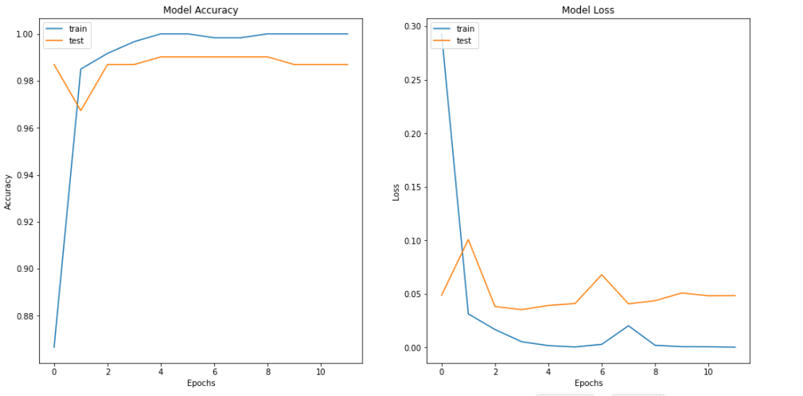

# Goal
Training a model that will differentiate between people wearing mask or not.

# Dataset description

The dataset is available on <a href="https://www.kaggle.com/datasets/prithwirajmitra/covid-face-mask-detection-dataset">Kaggle</a>.
The dataset consists of 600 training images, 306 validation images, and 100 for testing.

# Training Methodology
In this project, I used only transfer learning.
  * Load Data
  * Data augmentation
  * Model Construction : EfficientNetB1
  * Model Training

# Results

At the end of the training phase, I got 0.9869 for the validation accuracy and 0.0486 for the validation loss.

#### Testing

For this part, I wrote a python script to test the model from the Computer's Camera.

